## 勇者斗恶龙 (Dragon Quest)

写这篇文章的缘由是今日偶然看了一部世纪情怀动画电影——《勇者斗恶龙》。

勇者斗恶龙，这个名字很「中二」，但我偏偏很喜欢 :-D。熟悉这个 IP 的 90 后应该都知道是一款 RPG 游戏，在盛行 GBC/GBA/NDS 掌机的年代（对我来说，大概是2008 - 2011年这个时间段），相信这款游戏不少男生曾为之沉醉。

值得一提的是，其实它的英文翻译叫 "Dragon Quest, DQ"，直译的意思是「寻找恶龙」。现在看来，「勇者斗恶龙」这个中文翻译，满满的中二少年感。

回到电影本身，如果我没有记错的话，电影剧本是以游戏《DQ5：天空的新娘》的剧情为原型而创作的（「天空三部曲」的第二部，是我最喜欢的系列😋）。在此基础上，好像还加入了一点「洛特三部曲」的一点设定（疑惑状）？

电影开场，首先以马赛克式的游戏动画吸引老玩家的注意力。

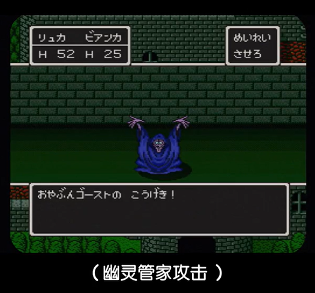

在开头一小时的电影里边，看的我满脸疑惑，比如：

+ 为什么「天空之剑」这么快就拿到了，导演你后面还怎么玩（拍）？
+ 为什么主角装备没出全就要去打小 Boss ？

我怀疑导演你是不是开了修改器 :=D 。

但也不是完全没有惊喜，出现了很多熟悉的怪兽：

+ 不知名剑齿虎和水滴史莱姆💧

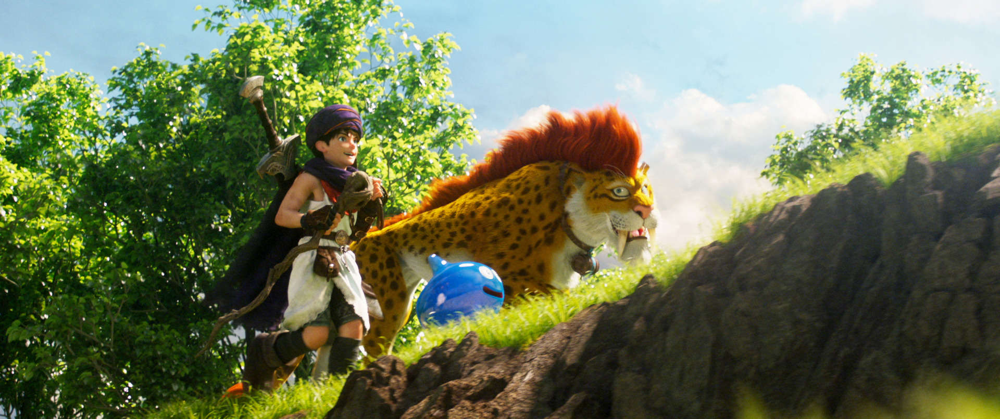

+ 金属史莱姆

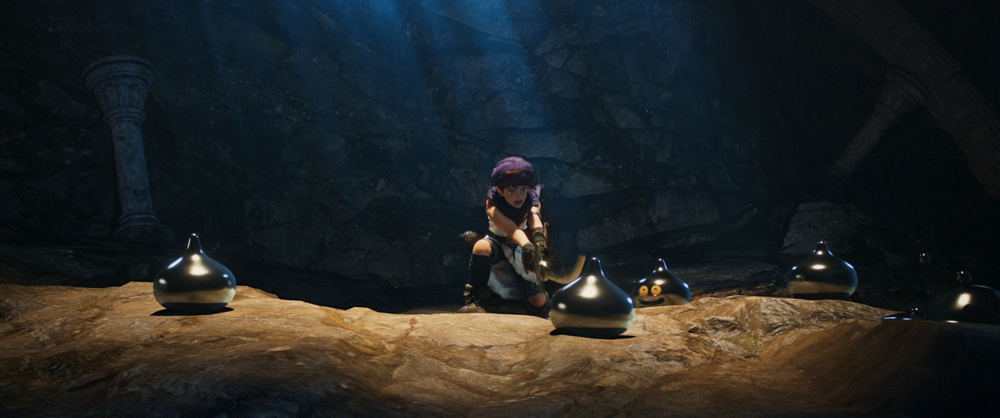

+ 史莱姆王

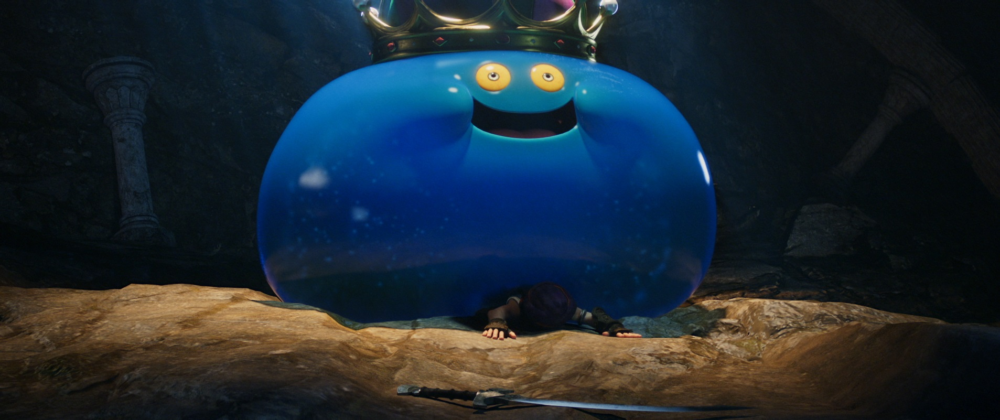

光凭这几张图片的还原度，所有不满烟消云散，大概这就是情怀的魅力吧🤪。

令我大脑多巴胺疯狂输出的是「结婚」的剧情🤪，游戏 DQ-5 里边引入结婚系统，有 2 个不同的结婚对象可供选择。电影里边，依旧是老套的剧情：驯服怪兽，拯救小镇，主角成名，迎娶女主（熟悉的配方，熟悉的味道）。

年少之时，我的选择是「芙萝拉」：

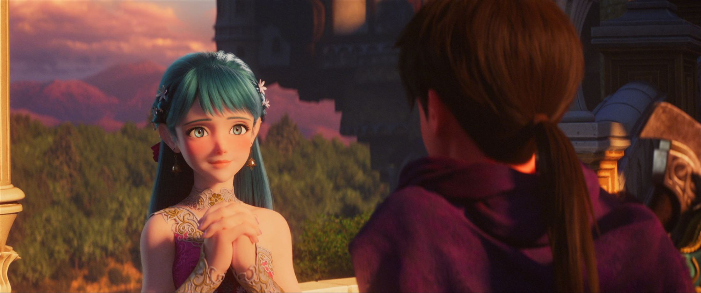

电影里边，主角的选择是青梅竹马「比安卡」：

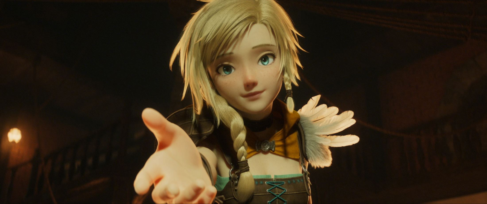

对原作剧情的高度还原，似乎让我回到一个风和日丽的下午，瞬间感觉自己年轻了十岁。

除此之外，个人觉得，最有趣、最精彩的还是最后 15min  的剧情：主角一家三口（没错，生了个儿子「雷克斯」，雷克斯才是剧情钦定的「天空勇者」）带上剧情钦定的「天空之剑」去挑战大 BOSS。一番恶战之后，居然跳出一个 NPC，告诉主角：这一切都是虚拟的，You are in the game.

NPC 发出对肥宅的嘲笑 :-D

| 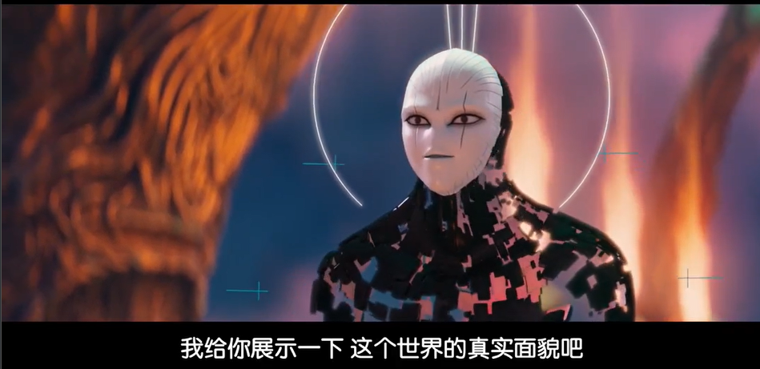 |  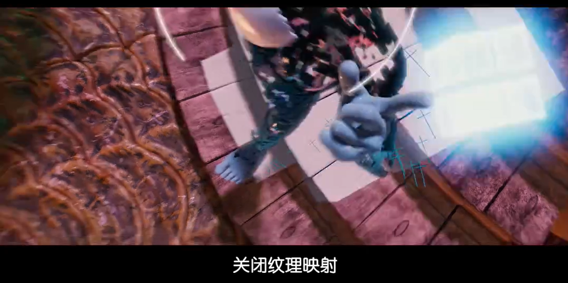  |
| :--------------------------------------: | :--------------------------------------: |
| 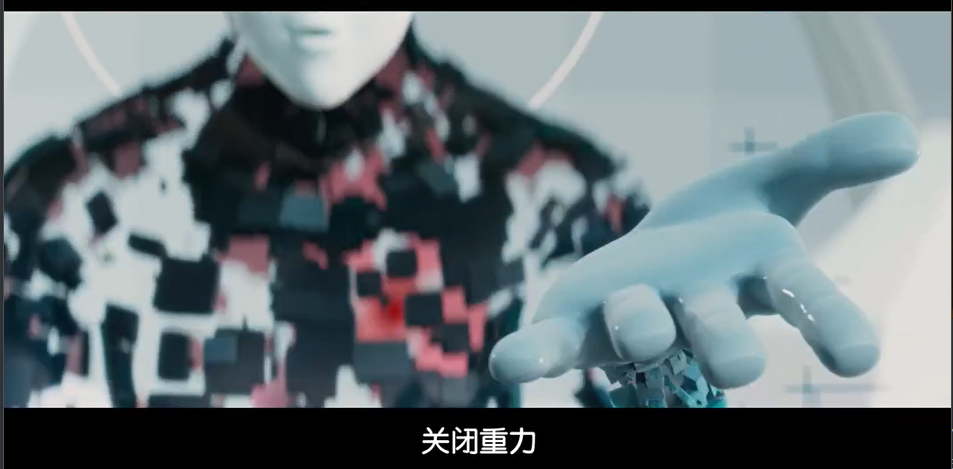 | 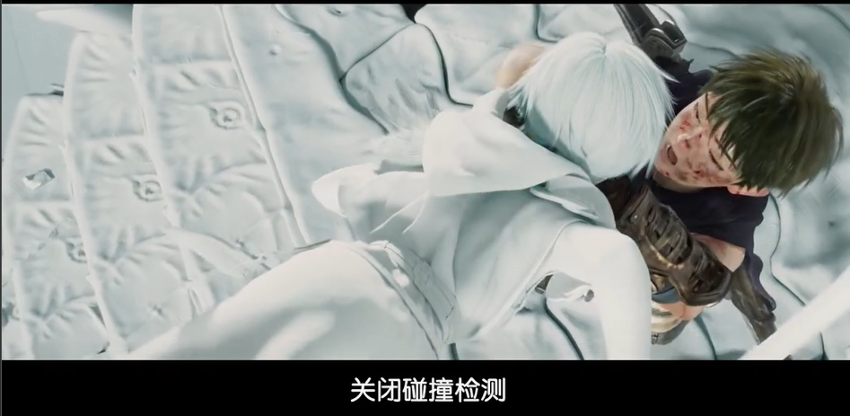 |
| 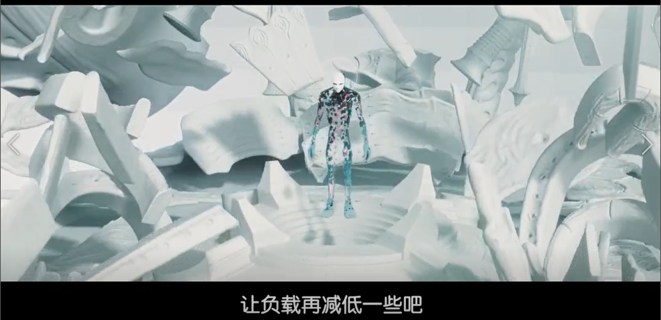 | 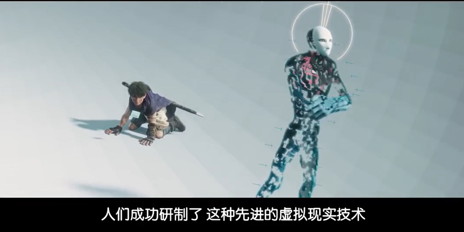 |

不知道导演拍这一段的用意是什么，不过看到这里的时候，这一段似乎想给观众还原游戏通关后落寞与空虚的感觉（似乎效果拔群）。

这部动画只有 100 分钟，叙事其实也是还原 RPG 游戏的流水账，为了说完主角三代人的故事，删减了不少冒险内容，并无任何高明之处，受众主要还是面向 DQ 玩家的（肥宅的💴最好赚）。

初中的时候玩《天空的新娘》这一作，按照 RPG 的传统，我一直以为主角必然就是钦定的「天空勇者」，但最终发现主角的儿子才是被钦定的那个，这一点小小的「反传统」，也算是 Nintendo 对 RPG 的一个小小的创新，并非是天选之子才能拯救世界，每个人都能成为拯救世界的英雄。

正如谁家少女不怀春，每一个中二少年都会把自己代入游戏/漫画/小说里的主角，成为一个自我臆想的「英雄」，仗剑走天涯，勇者斗恶龙。

正如片尾中主角所说的（似乎也说出了诸位肥宅🐖的心声）：

> 游戏里面的世界对我来说并非虚假的，就算只是电脑程序，但我与他们一起度过的时光是真实的。那些旅途、冒险、战斗，每一份相遇，都印在脑海当中，是另一个真实的世界。

游戏到底是「第九艺术」还是「电子鸦片」，其实并不重要。重要的是什么？这个问题也不重要，我相信每个人心中都有一个属于自己的答案。

值得一提的是，这部动画的全名是《勇者斗恶龙：你的故事》，属于每一名观众，每一名玩家心中的故事。

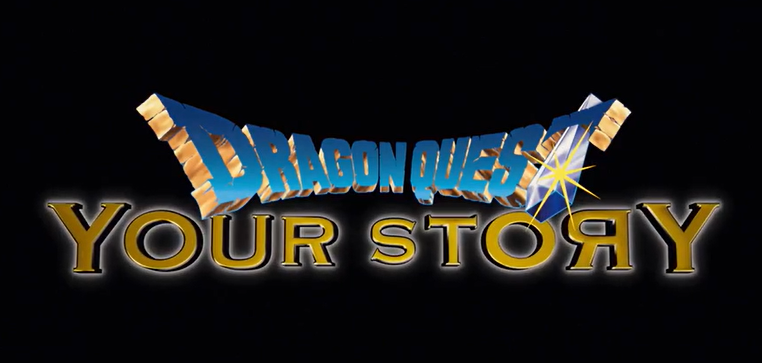

