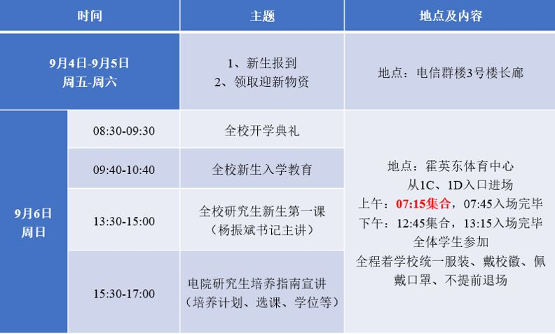

## 在闵大荒的日子（二）

&emsp;&emsp;2020 年 9 月 6 日是开学的第一天。

&emsp;&emsp;一天都被安排「开会」，而且是那种一开场就知道后面走势的无聊会议，说实在的，是有那么一点厌烦。

&emsp;&emsp;记得前一晚，3 点多醒了一次，然后迷迷糊糊地睡到早上 6 点，习惯性赖床，直到 6:24 才起床，然后随随便便洗漱，剃胡须，去四餐吃了在学校的第一顿早餐（无拍照📸），最后和室友 H 和室友 S 一同前往霍英东体育馆（也没有拍照片😅）。

&emsp;&emsp;一天过去了，说实在的，这些会议的内容我都没什么印象了。

&emsp;&emsp;[开学典礼](https://mp.weixin.qq.com/s?__biz=MjM5MDIyMDQyMA==&mid=2650669008&idx=1&sn=f38a24468ed62992e45a95887bf485cd&chksm=be41763b8936ff2d1f96af403da4412a49a0d7ae0101a18b9be6125ab714344ecf8b0a4ba8ff&scene=126&sessionid=1599405493&key=5024aebfdb310a340730917e27294803aa054f876ccae9be0c6d2df828411445938e0201bebeca3f67386d45e715a8b512890c7fbede520f27036e6b93692b5bc902260a3a24c8c062d87490490f61059685bf040201804a729108c703ea34f5fc66cf8cc90358579824894c6b558c3379ff7bfd3f68ac4be443f07d48580bca&ascene=1&uin=MTY2ODQ5MTU4Mw%3D%3D&devicetype=Windows+10+x64&version=62090529&lang=zh_CN&exportkey=A48HwpQdVv5grT2IRAhplAQ%3D&pass_ticket=ANSDrm29NLFvLWDxL42VyKMcHogWuSjBaFq%2Bo2W1zSGQ60sT0poLN8hfD%2FaIpSgR&wx_header=0)只记得有宣誓仪式，奏唱校歌，[校长讲话](https://mp.weixin.qq.com/s?__biz=MzUxODE2OTM4MQ==&mid=2247488786&idx=2&sn=16a25eaaa7621e2af86198c8ccca6ec8&chksm=f98da358cefa2a4e68c5eb779913d33e0b7b0cf8ad66cadb010c98a7e2a1afd056bfdffea694&scene=126&sessionid=1599405917&key=f574234d23a6155862afee0fcf7f3b32453f59ae8e21e821165432ecc549c2185079223a877a44a2e2f9aa84626ce6727fc0742a97d1f5f828e7e10a5a4251afdae7e380ae437b5f926a279e34dbaf9d3ecb0ce950a5d5cd60083e96446f13b27c8ec120f04ea4e08ad99d32d847e900bee46b9980e13193324aa30504216b69&ascene=1&uin=MTY2ODQ5MTU4Mw%3D%3D&devicetype=Windows+10+x64&version=62090529&lang=zh_CN&exportkey=A4z8W5LEPOhwlnaH%2FAMY7W4%3D&pass_ticket=ANSDrm29NLFvLWDxL42VyKMcHogWuSjBaFq%2Bo2W1zSGQ60sT0poLN8hfD%2FaIpSgR&wx_header=0)，还有风趣十足的保卫处主任玩梗：**终身记住 54749110** 。当然，典礼前发的「益友」校报上面的新生文摘，我倒是挺认真地浏览了一遍，因为我实在是太无聊了。

&emsp;&emsp;新生入学教育无非讲得就是学术诚信之类的，我现在已经不记得是谁在讲，讲了多长，讲了什么，我一问三不知。

&emsp;&emsp;值得一提的是党委书记的新生第一课——[选择了交大就选择了责任](https://mp.weixin.qq.com/s?__biz=MjM5MDIyMDQyMA==&mid=2650669050&idx=1&sn=0a7caa05985d96b88f57175e7f1302d3&chksm=be4176118936ff07203f880eb52c1bb4c0c8f38852f25c558ebf529c1bf30b2e8ec7602feabb&scene=126&sessionid=1599483039&key=e0a4d01c3985cc28aa9686564abf5ed598ff67b2c729ac182dcea183857662c561095da81c41995465bf92f6c094bb9b9b089dce1e1f3868726e6100793af14548f2515b257be30df96f5d2b1997eab3c390b99eee22fb89377218d2ef65bb08c22daa94ef303f231a070c254eaaa8ed5bc969650437ff3aaed3718a3b8fbe41&ascene=1&uin=MTY2ODQ5MTU4Mw%3D%3D&devicetype=Windows+10+x64&version=62090529&lang=zh_CN&exportkey=A5tvt5K%2FAAa%2FNbojHANLqQE%3D&pass_ticket=OLcFM6FdxGgT27IhSIva8kPAUWK49IdlYHHzEawU4zaYVnUsK6I3gdwoMM7X2rJk&wx_header=0)，题目貌似从「选择了清华就选择了一生的责任」这句话改过来的(・∀・(・∀・(・∀・*)，我大致用心（实际上是漫不经心）听了学校的历史部分。作为党委书记，我觉得他确实是下了功夫去准备的，这部分内容让我对 SJTU 的建立、学校的拆分（没想到 NUAA 是从这里的航空系拆分出去的）、闵大荒校区的创建、SJTU 与国内其他高校的「爱恨情仇」都有了一定程度的了解。说实在的，对于本科学校，待了 4 年，我都没这么深入地了解过 NUAA 校史，有点惭愧。

&emsp;&emsp;至于介绍某位知名老学长的部分，必然是最能吸引大家的注意力的，懂的都懂 😄 ，当时班里的同学就开始在班群接龙了，嗯，就是是最著名的那两句。

&emsp;&emsp;最后是电院的研究生培养宣讲，饶了我吧，因为实在是太饿了。

&emsp;&emsp;晚上看了一下培养计划，和导师、室友讨论了一下选课的事情（How to get higher GPA 🐶），无事可记。

&emsp;&emsp;说实在的，我觉得我导也是纯放羊类型的，希望自己剩下的 2 年能踏踏实实钻研并掌握一个技术方向（不要再当懒🐶），而且但愿后面能顺利毕业🎓吧，现在已经丝毫没有继续攻读 Phd 的念头了。

&emsp;&emsp;2020 年 9 月 7 日，星期一，天气晴朗🌞，是正式上课的第一天。

&emsp;&emsp;第一周只有 2 门政治课，都在今天下午，自然辩证法概论和中国特色社会主义理论与实践研究（这个这么长的名词让我想起了另外一个特别长的「习~近~平~新~时~代~中~国~特~色~社~会~主~义~指~导~思~想」🤣）。本科的马原、毛概已经是无聊到极致的噩梦了，没想到研究生还要从头再来一遍，目无表情😶。而且是下午 2 节课连在一起，让我整个上课过程都处于游离状态。

&emsp;&emsp;至于上课的感受，并没有感受到与本科有什么不一样，甚至感觉硕士生的课程设置比本科水得不知道哪里去。大概这就是扩招与文凭贬值的后果——学士后生涯。

&emsp;&emsp;然后，就酱吧，是日无事可记啦。这种毫无意义的日记估计以后也不会再写了，下一篇「闵大荒的日子」预计会在国庆假期之后吧。

&emsp;&emsp;2020 年 9 月 7 日，于上海闵行。